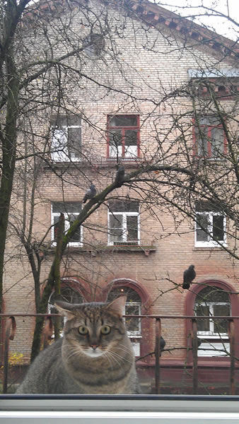
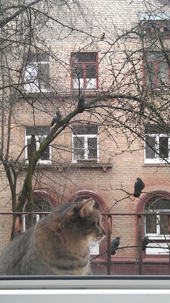
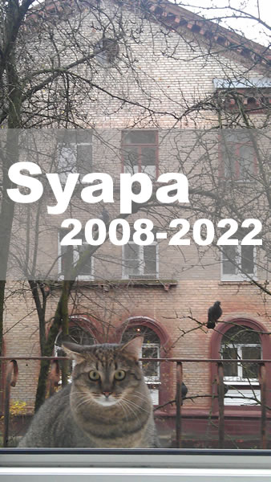

# PHP Compare Image (algoritm Average Hash, Simple Hash)
A fast image comparison library for PHP 8. Get Average Hash string and detect duplicate image.
Solution from [nvthaovn/CompareImage](https://github.com/nvthaovn/CompareImage) was refactored (tested on PHP 8.2).

## Example (two similar but different pictures)

#### 1.jpg


#### 2.jpg


```php
include 'AverageHash.php';

$hash1 = AverageHash::getHash('1.jpg');
$hash2 = AverageHash::getHash('2.jpg');

echo "Difference between $hash1 and $hash2: " . AverageHash::compare($hash1, $hash2);
// difference = 15
```
#### 3.jpg


```php
$hash3 = AverageHash::getHash('3.jpg');

echo "Difference between $hash1 and $hash3: " . AverageHash::compare($hash1, $hash3);
// difference = 10
// if different rates <= 10 then the images are duplicate
```
